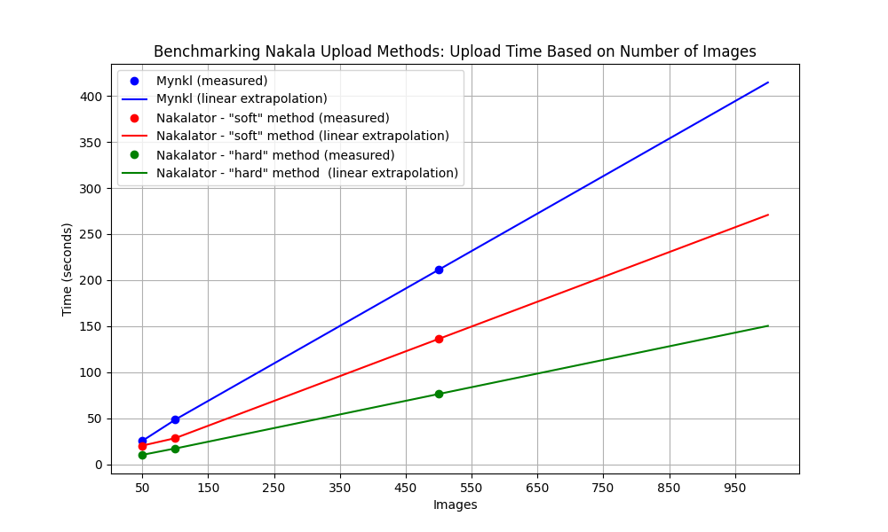

# Nakalator CLI


Nakalator est un CLI qui permet l'envoi d'images par lot sur un dépôt Nakala (**donnée uniquement**).

Il peut-être conçu comme une alternative à l'outil [Mynkl](https://mynkl.huma-num.fr/). 

Les avantages de Nakalator sont les suivants :

- **Retour utilisateur** : permet de tracer le nombre d'images envoyées sur Nakala en cours d'envoi ; 
- **Performances** : suivant le type de machine utilisé et la quantité d'images, Nakalator réduit le temps d'envoi des images sur Nakala (Cf. Benchmark dans [Performances](#performances)).

----

## Sommaire

- [Installation du CLI](#installation-du-cli)
- [Marche à suivre](#marche-à-suivre)
- [Performances](#performances)
- [FAQ](#faq)

### Installation du CLI

Cloner le projet :

```bash
git clone git@github.com:chartes/Nakalator.git
```

Méthode 1 (recommandé) :

```bash
make all 
```
puis tester l'installation :

```bash
python3 nakalator.py --help
```

Méthode 2 :

1. créer un environnement virtuel (par exemple avec virtualenv):
```bash
virtualenv -p python3.9 venv
```

2. activer l'environnement virtuel :
```bash
source venv/bin/activate
```

3. installer les dépendances :
```bash
pip3 install -r requirements.txt
```

4. tester l'installation :
```bash
python3 nakalator.py --help
```

### Marche à suivre

1. Éditer le fichier `credentials.yml` avec
la clé d'API Nakala correspondant a votre compte utilisateur Nakala. Si vous ne disposez pas
de clé d'API Nakala (Création d'un compte Human-id et demande d'accès à Nakala requis), vous pouvez utiliser une clé d'API de test sur https://test.nakala.fr/ (cette clé sera utilisable uniquement sur l'instance Nakala de test).

2. Déposer les images à envoyer dans un sous-dossier du dossier `data/`. Une donnée == un dossier == un lot d'images.
> [!TIP]
> Prévoyez un plan de nommage pour les images en amont de l'envoi, celui-ci déterminera l'ordre des images dans Nakala.

3. Créer et compléter le fichier `metadata_{nom_du_projet}.yml` (vous pouvez vous inspirer du fichier [`metadata_example.yml`](https://github.com/chartes/Nakalator/blob/master/metadatas/metadata_example.yml))
dans le dossier `metadatas/` qui rassemble les métadonées du lot d'image à envoyer.

> [!TIP]
> Pour plus d'informations sur les métadonnées Nakala : [documentation Nakala](https://documentation.huma-num.fr/nakala-guide-de-description/).

> [!TIP]
> Une fois la donnée créée il est toujours possible de modifier ou d'ajouter les métadonnées dans l'interface Nakala.

4. Enfin vous pouvez lancer le CLI avec la commande suivante et répondre aux instructions :

```bash
python3 nakalator.py -m hard
```

Deux méthodes d'envoi sont disponibles :

- La méthode `soft` : cette méthode utilise un algorithme classique qui envoi les images une par une sur Nakala.
- La méthode `hard` : cette méthode utilise un algorithme qui envoi les images en parallèle sur Nakala.

5. A la fin du processus, un fichier `{nom_du_projet}_mapping_ids_{date}.csv` sera généré dans le dossier `output/` contenant le *mapping* des images envoyés sur Nakala et des identifiants (DOI et sha1) (attention à bien archiver ce fichier qui sera utilisé pour la génération des manifestes IIIF).

6. A la fin du processus, vous pouvez passer dans l'interface Nakala pour vérifier que les images ont bien été envoyées : 
    - vous pouvez modifier manuellement les métadonnées des données
    - vous pouvez ajouter des fichiers supplémentaires (si nécéssaire)
    - vous pouvez utiliser un tri pour remettre les images dans l'ordre (Cf. [FAQ](#faq) pour plus d'informations)
    - vous pouvez passer en mode "publié" (au lieu de privé) pour que les données soient visibles par tous.
      
> [!WARNING]
> Le nombre de données en mode "privé" est limité sur Nakala, pensez à publier ces données au fur et à mesure.

> [!WARNING]
> Une fois la donnée "publié" dans Nakala, il n'est plus possible de la supprimer (contacter le support de Nakala).

### Performances

Pour les tests de performances nous avons constitué 3 lots d'images (**subsets**) de 100, 500 et 1000 images.

> [!NOTE]
> Ces résultats sont obtenus sur une machine disposant d'un processeur Apple M1 pro et de 16Go de RAM. Ils
peuvent varier suivant la configuration de la machine.

Les résultats obtenus sont les suivants :

| Total images | Mynkl (seconds) | Nakalator - "soft" method (seconds) | Nakalator - "hard" method (seconds)|
|--------------|-----------------|----------------------------|---------------------------|
| 50           | 25.40           | 20.26                      | 10.23                     |
| 100          | 48.48           | 28.37                      | 17.11                     |
| 500          | 211.2           | 136.11                     | 76.30                     |




### FAQ

- *Comment faire pour remettre les images dans l'ordre dans Nakala ?*

    > Vous pouvez vous rendre sur la page de la donnée créer dans Nakala : utiliser l'icône de tri et sauvegarder les modifications.
    
    
