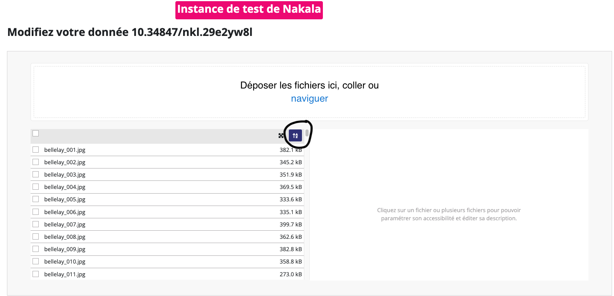

# Nakalator CLI


Nakalator est un CLI qui permet l'envoi des images sur un dépôt Nakala (donnée uniquement).

Il est peut-être conçu comme une alternative à l'outil [Mynkl](https://mynkl.huma-num.fr/).


## Sommaire

- [Installation du CLI](#installation-du-cli)
- [Marche à suivre](#marche-à-suivre)
- [FAQ](#faq)

### Installation du CLI

Cloner le projet :

```bash
git clone git@github.com:chartes/Nakalator.git
```

Méthode 1 (recommandé) :

```bash
make all 
```
puis tester l'installation :

```bash
python3 nakalator.py --help
```

Méthode 2 :

1. créer un environnement virtuel (par exemple avec virtualenv):
```bash
virtualenv -p python3.9 venv
```

2. activer l'environnement virtuel :
```bash
source venv/bin/activate
```

3. installer les dépendances :
```bash
pip3 install -r requirements.txt
```

4. tester l'installation :
```bash
python3 nakalator.py --help
```

### Marche à suivre

1. Éditer le fichier `credentials.yml` avec
la clé d'API Nakala correspondant a votre compte utilisateur Nakala. Si vous ne disposez pas
de clé d'API Nakala, vous pouvez utiliser une clé d'API de test sur https://test.nakala.fr/  (instance de test uniquement).

2. Déposer les images à envoyer dans un sous-dossier du dossier `data/`. Une donnée == un dossier == un lot d'images. 
Attention au nommage des images qui déterminera l'ordre des images dans Nakala.

3. Créer et compléter le fichier `metadata_{nom_du_projet}.yml` (vous pouvez vous inspirer du fichier `metadata_example.yml`)
dans le dossier `metadatas/` qui rassemble les métadonées du lot d'image à envoyer.

4. Enfin vous pouvez lancer le CLI avec la commande suivante et suiver les instructions :

```bash
python3 nakalator.py --hard
```

- La méthode `--soft` : cette méthode utilise un algorithme classique qui envoi les images une par une sur Nakala.
- La méthode `--hard` : cette méthode utilise un algorithme qui envoi les images en parallèle sur Nakala.

5. A la fin du processus, un fichier `report_{nom_du_projet}.csv` sera généré dans le dossier `reports/` contenant le *mapping* des images envoyés sur Nakala et des identifiants (DOI et sha1) (attention à bien archiver ce fichier qui sera utilise pour la génération des manifestes IIIF).

6. Si tout semble OK, vous pouvez passer dans l'interface Nakala pour vérifier que les images ont bien été envoyées : 
    - vous pouvez modifier manuellement les métadonnées des données
    - vous pouvez ajouter des fichiers supplémentaires (si nécéssaire)
    - vous pouvez utiliser un tri pour remettre les images dans l'ordre
    - vous pouvez passer en mode "publié" (au lieu de privé) pour que les données soient visibles par tous (important, car 
   le nombre de données en "privé" est limité).

### FAQ

- **Comment je fais pour remettre les images dans l'ordre dans Nakala ?**

    Vous rendre sur la page de la donnée dans Nakala, utilisé l'icone de tri et sauvegarder les modifications.
    
    