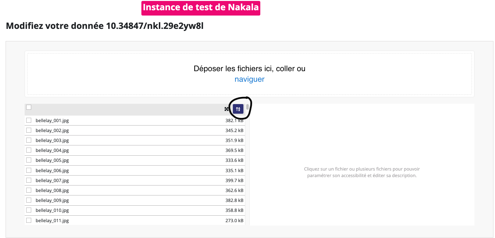

# Nakalator CLI

 

<!-- Pypi pkg badge  -->

Nakalator est un outil en ligne de commande (CLI) conçu pour faciliter la création de dépôts et l'envoi de fichiers sur la plateforme [Nakala](https://nakala.fr/) 

Nakalator permet de :
- Créer un dépôt dans Nakala avec des métadonnées associées en utilisant un fichier YAML ;
- Envoyer des fichiers (par exemple, des images) sur Nakala associés à une donnée spécifique ;
- Créer une collection de données ou rattacher des données à une collection déjà existante dans Nakala.

Il peut être considéré comme une alternative à l'outil [Mynkl](https://mynkl.huma-num.fr/).

Les avantages de Nakalator sont les suivants :

- **Retour utilisateur** : Nakalator permet de suivre en temps réel le nombre de fichiers en cours d'envoi dans Nakala ;
- **Performances** : En fonction de la machine utilisée et de la quantité de fichiers, Nakalator réduit le temps d'envoi des fichiers sur Nakala grâce à une méthode d'envoi **multi-threads** (goroutines) ;
- **Intégrité des données** : Tests automatiques effectués après l'envoi des fichiers.
- **Post-traitements** : Génération d'un rapport (*mapping*) pour les fichiers envoyés sur Nakala, contenant les identifiants DOI et SHA-1 pour aider, par exemple, à la génération des manifestes .

----

## Sommaire

- [Installation](#installation)
- [Marche à suivre](#marche-à-suivre)
- [FAQ](#faq)

### Installation

#### Méthode 1 (recommandée)

1. Installez le CLI via `pip` dans un environnement virtuel ou non : 

```bash
# (optionnel :) virtualenv -p python3.9 venv # exemple avec python3.9 mais vous pouvez choisir une autre version python3.10 par exemple
# (optionnel :) source venv/bin/activate 
pip install nakalator
```

2. Testez l'installation :

```bash
nakalator --help
```

Passer à la section [Marche à suivre](#marche-à-suivre) de Readme pour commencer à utiliser Nakalator.

#### Méthode 2 

1. Clonez le projet (via https ou ssh) :

```bash
git clone git@github.com:chartes/Nakalator.git # exemple avec ssh ici
cd Nakalator/
```

2. (Optionnel) Créez un environnement virtuel avec `virtualenv`, `pyenv`, etc. ici avec `virtualenv` par exemple :

```bash
virtualenv -p python3.9 venv # exemple avec python3.9 mais vous pouvez choisir une autre version python3.10 par exemple
source venv/bin/activate
```

3. Installez le CLI :

```bash
pip install -e .
```

4. Testez l'installation :

```bash
nakalator --help
```

Passer à la section [Marche à suivre](#marche-à-suivre) de Readme pour commencer à utiliser Nakalator.

#### Méthode 3 (non requis pour les utilisateurs. Concerne uniquement le développement de nakalator)

1. Clonez le projet :

```bash
git clone git@github.com:chartes/Nakalator.git
cd Nakalator/
```

2. Créer un environnement virtuel avec `virtualenv`, `pyenv`, etc. ici avec `virtualenv` par exemple :

```bash
virtualenv -p python3.9 venv # exemple avec python3.9 mais vous pouvez choisir une autre version python3.10 par exemple
source venv/bin/activate
```

3. Installez les dépendances :

```bash
pip install -r requirements-dev.txt
```

3. Puis lancer l'outil pour tester :

```bash
python3 nakalator.py --help
```

Si vous êtes dans le dossier `Nakalator/nakalator_workspace` :
    
```bash
python3 ../nakalator.py --help
```

##### Commandes pour le développement très spécifiques

> [!WARNING]
> Le langage Go est nécessaire pour faire fonctionner les commandes suivantes.

**Si et seulement si cela est nécéssaire** : pour compiler l'ensemble du projet (build, dist, etc. et hors sources GO) avant la distribution via Pypi depuis `Naklator/` :

```bash
make build_pkg VERSION_PKG=0.0.1-beta # exemple de version à spécifier 
```

**Si et seulement si cela est nécéssaire** : en cas de modification des sources Go, vous devez recompiler le binaire depuis `Naklator/` **pour Linux et pour MacOS** :

sous linux : 
  
```bash
make build_go
```

Cela créé alors un binaire `nakala_request.so` dans le dossier `lib/bridge/`
  
sous MacOS :
  
```bash
make build_go # même commande que pour linux
 ```
  
Cela créé alors un binaire `nakala_request.dylib` dans le dossier `lib/bridge/`

### Marche à suivre

1. Une fois l'installation effectuée, et lors de la première utilisation de l'outil, commencez par créer votre environnement de travail (nommé `nakalator_workspace/`) via la commande suivante :

```bash
nakalator init
```
La commande crée un dossier `nakalator_workspace/` dans votre répertoire courant.
Il s'agit de votre espace de travail privilégié et toutes les commandes Nakalator doivent être exécutées à partir de ce dossier.
Ce dossier contiendra : 

- les **fichiers de configuration** temporaires (au format YAML) nécessaires pour l'envoi des données sur Nakala (dossier `metadatas/`) ; 
- les **fichiers à envoyer** (dossier `data/`) 
- les **rapports** (*mapping*) des données envoyées (dossier `output/`)

Notez également la présence d'un fichier nommé `credentials.yml` pour renseigner les informations de connexion à Nakala (clés API)
en test (https://test.nakala.fr/) ou en production (https://nakala.fr/).


2. Commencer par remplir le fichier `credentials.yml` avec les informations de connexion à Nakala (clés API).
Pour l'instance de test, des clés d'API sont disponibles sur la page d'accueil de l'instance de test de Nakala (https://test.nakala.fr/).
Pour l'instance de production Nakala, vous devez disposer d'un compte HumanID auprès d'Huma-Num et effectuer une demande d'accès à Nakala.

3. L'organisation des fichiers de métadonnées YAML et des fichiers à envoyer est cruciale. 
Le fichier pivot YAML contient les métadonnées de la donnée à envoyer sur Nakala et les liens vers les fichiers à envoyer.
Plusieurs cas d'usage sont possibles, les plus courants sont :

- **Création d'une donnée sur Nakala (rattachée ou non à une collection existante ou à créer) avec des fichiers associés (par exemple, des images)** :
  1. Déposez votre fichier YAML (préalablement rempli) dans le dossier `metadatas/` (par exemple `metadatas/mon_projet.yml`) ;
  2. Déposez vos images dans un dossier spécifique dans `data/` (par exemple `data/mon_projet/image1.jpg`, `data/mon_projet/image2.jpg`, etc.).
  
  Voici un exemple de structure de dossiers pour ce cas d'usage :
  ```
   nakalator_workspace/
       |
       ├── metadatas/
       │    ├── mon_projet.yml
       │
       ├── data/
            ├── mon_projet/
                 ├── image1.jpg
                 ├── image2.jpg
  ```

- **Création de plusieurs données (envoi en lot) sur Nakala (rattachées ou non à une collection existante ou à créer) avec des fichiers associés (par exemple, des images) pour chacune d'elles** :
  1. Déposez vos fichiers YAML (préalablement remplis) dans un sous-dossier situé dans le dossier `metadatas/` (par exemple `metadatas/mon_projet/mon_projet_1.yml`, `metadatas/mon_projet/mon_projet_2.yml`) ;
  2. Déposez vos images dans des sous-dossiers spécifiques placés dans un sous-dossier (portant le nom du projet) de `data/` (par exemple `data/mon_projet/mon_projet_1/image1.jpg`, `data/mon_projet/mon_projet_1/image2.jpg`, `data/mon_projet/mon_projet_2/image1.jpg`, `data/mon_projet/mon_projet_2/image2.jpg`, etc.).
  
  Voici un exemple de structure de dossiers pour ce cas d'usage :
  ```
    nakalator_workspace/
         |
         ├── metadatas/
         │    ├── mon_projet/
         │         ├── mon_projet_1.yml
         │         ├── mon_projet_2.yml
         │
         ├── data/
                ├── mon_projet/
                  ├── mon_projet_1/
                         ├── image1.jpg
                         ├── image2.jpg
                  ├── mon_projet_2/
                         ├── image1.jpg
                         ├── image2.jpg
  ```


> [!TIP]
> Pour remplir le fichier YAML, vous pouvez vous inspirer du fichier `metadata_example.yml` présent dans le dossier `nakalator_workspace/` lors de l'initialisation de l'environnement de travail. 
> Vous remarquerez que certaines informations sont obligatoires et d'autres facultatives.
> Vous pouvez également consulter le dossier `examples/` qui contient des exemples de fichiers de métadonnées inspirés d'autres projets.

> [!TIP]
> Prévoyez un plan de nommage rigoureux pour les images avant l'envoi, car cela déterminera l'ordre des images dans Nakala.

> [!TIP]
> Si vous avez plusieurs données à créer, vous pouvez utiliser les suffixes spéciaux `_PREV` et `_NEXT`. La donnée avec le suffixe `_PREV` sera automatiquement placée en première position et celle avec le suffixe `_NEXT` en dernière position. Cela peut être utile pour les pages liminaires et postliminaires d'un document, par exemple.

> [!TIP]
> Pour plus d'informations sur les métadonnées Nakala, consultez la [documentation Nakala](https://documentation.huma-num.fr/nakala-guide-de-description/).

4. Une fois l'étape 2 terminée, vous pouvez lancer l'envoi des données sur Nakala depuis le répertoire `nakalator_workspace/` :

```bash
nakalator main
```

Suivez les instructions et répondez aux questions posées par le CLI.

> [!TIP]
> Une fois la donnée créée, il est toujours possible de modifier ou d'ajouter des métadonnées dans l'interface Nakala suivant l'instance désignée (production ou test).

5. À la fin du processus, un ou plusieurs fichiers de mapping seront générés dans le dossier `output/` de votre `nakalator_workspace/`. Le nommage est le suivant :

   - Donnée rattachée à une collection : `data_{ordre}_{doi_de_la_collection}_{doi_de_la_donnee}.csv`
   - Donnée non rattachée à une collection : `data_{ordre}_{doi_de_la_donnee}.csv`

Ce fichier, à bien conserver, contient l'ensemble des fichiers envoyés sur Nakala avec les identifiants DOI et SHA-1 associés.

6. Vous pouvez vérifier dans l'interface Nakala que les données ont bien été envoyées :

- Modifier manuellement les métadonnées des données.
- Ajouter des fichiers supplémentaires si nécessaire.
- Si les images ne sont pas triés, utiliser la fonction de tri pour remettre les images dans l'ordre dans Nakala (cf. [FAQ](#faq) pour plus d'informations).
- Passer les données et les collections en mode "publié" (au lieu de "privé").

> [!WARNING]
> Le nombre de données en mode "privé" est limité sur Nakala, pensez
> à contrôler votre stockage régulièrement et à publier ces données au fur et à mesure surtout si vous avez un grand nombre de données à envoyer.

> [!WARNING]
> Une fois la donnée "publiée" dans Nakala, il n'est plus possible de la supprimer (contactez le support de Nakala).

### FAQ

- **Comment remettre les images dans l'ordre sur Nakala ?**

    > Vous pouvez vous rendre sur la page de la donnée créée dans Nakala, utiliser l'icône de tri, puis sauvegarder les modifications.
    
    